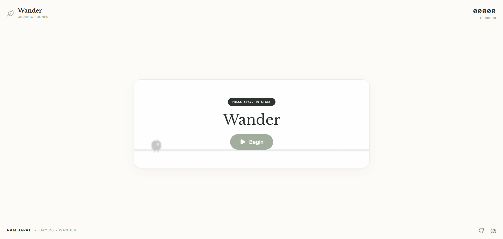
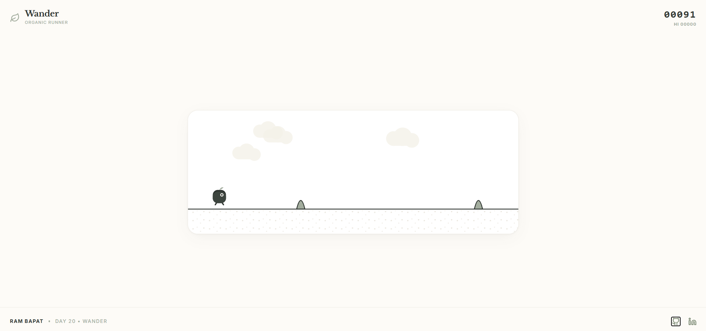
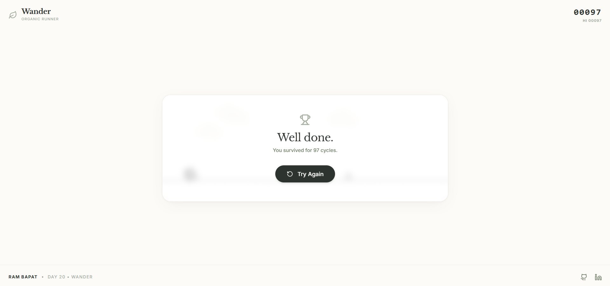

# ⬛ Silhouette

    

**Day 21 / 30 - April Vibe Coding Challenge**

## 🔗 [Live Demo](#)

**Silhouette** is an ultra-premium, minimalist visual geometry challenge. Evaluate striking custom-drawn SVGs of geometric shapes and answer rigorous visual questions. True to examinations, you receive zero feedback until the final results screen. 

## 📸 Screenshots







## ✨ Features

*   **📐 5 Custom SVG Puzzles:** Features deep black, perfectly mathematical inline SVGs (Pentagon, Hexagon, Trapezoid, Octagon, and Rhombus) cast against a bright, museum-like layout.
*   **📊 Live Progress HUD:** Features an elegant scoreboard that dynamically tracks correct/incorrect marks via premium monochrome icons and keeps a running tally.
*   **🏆 Tiered Assessment Grading:** Receive a Gold, Silver, Bronze, or Failure trophy icon based strictly on your final geometry competency. Includes a sleek, printable-style receipt comparing your choices against the correct answers.
*   **🎨 Editorial Web Aesthetic:** Designed with a striking, high-contrast monochrome palette (`#0A0A0A` and `#F7F7F9`). Typography utilizes `Playfair Display` and `Inter` for an elegant, luxurious academic feel.
*   **🚀 Seamless Animations:** Powered by Framer Motion for buttery-smooth horizontal page transitions and bouncy trophy physics.

## 🛠️ Tech Stack

*   **Frontend Framework:** React 19 + Vite
*   **Styling:** Tailwind CSS 4 (Luxury Monochrome Theme)
*   **Animations:** Framer Motion (`motion/react`)
*   **Fonts:** `Playfair Display` + `Inter`
*   **Icons:** Lucide React

## 🚀 Getting Started

### 1. Clone the Repository
```bash
git clone https://github.com/Barrsum/Silhouette-Quiz.git
cd Silhouette-Quiz
```

### 2. Install Dependencies
```bash
npm install
```

### 3. Run the App
```bash
npm run dev
```

## 👤 Author

**Ram Bapat**
*   [LinkedIn](https://www.linkedin.com/in/ram-bapat-barrsum-diamos)
*   [GitHub](https://github.com/Barrsum)

---
*Part of the April 2026 Vibe Coding Challenge.*
